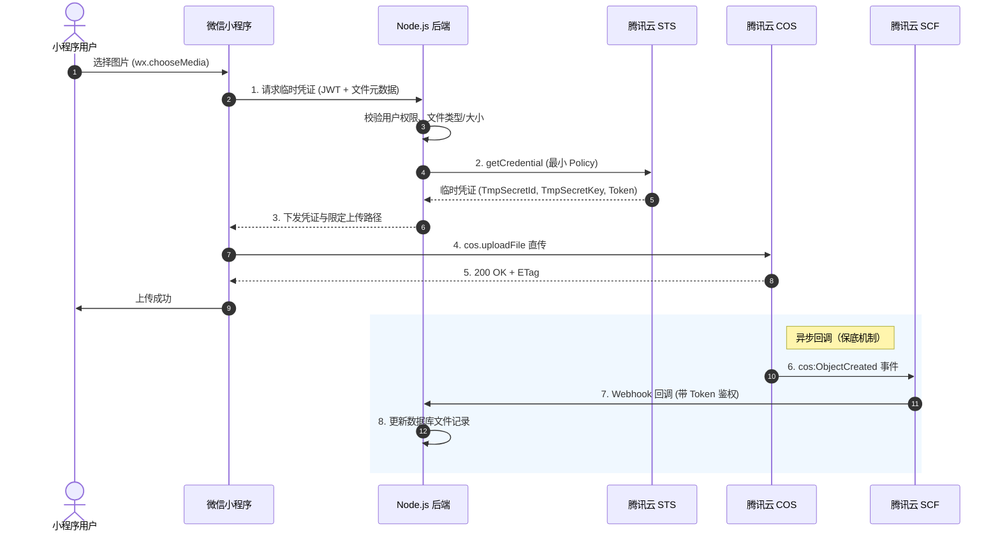

# 腾讯云 COS 安全上传与访问控制方案调研

> **议题来源**：[调研腾讯云 COS 安全上传与访问控制方案](https://github.com/coocssweb/comic_strip/issues/6)（Part of [#1](https://github.com/coocssweb/comic_strip/issues/1)）
>
> **调研范围**：Node.js 后端 + 微信原生小程序组合下，COS 安全上传、临时凭证、对象访问控制和防滥用方案；各方案对密钥暴露、后端带宽、文件校验和运维复杂度的影响。

---

## 一、核心架构结论

**推荐架构**：后端签发 STS 临时凭证 → 小程序直传 COS → COS 事件通知异步回调后端。

```
小程序 → 后端请求临时凭证 → 后端调用 STS → 小程序用临时凭证直传 COS → COS 异步通知后端
```

核心原则：
1. **密钥不暴露**：永久密钥只存后端，小程序仅接触短生存期临时凭证
2. **带宽不经后端**：文件数据流直连 COS 节点，后端只处理凭证签发和回调
3. **最小权限**：STS Policy 精确限定 Bucket/路径/操作，临时凭证有效期尽量短

---

## 二、上传方案对比

### 方案 A：STS 临时凭证 + cos-wx-sdk-v5 直传（推荐）

| 维度 | 说明 |
|------|------|
| 流程 | 后端通过 `qcloud-cos-sts` SDK 生成临时凭证 → 下发小程序 → 小程序初始化 `cos-wx-sdk-v5` 后调用 `cos.uploadFile` 直传 |
| 密钥暴露 | 无。永久密钥只在后端，临时凭证有效期 900~7200 秒 |
| 后端带宽 | 不消耗。文件不经过后端服务器 |
| 文件校验 | 后端在签发凭证前校验文件类型、大小；SDK 自动处理 ETag 完整性校验 |
| 运维复杂度 | 低。需维护 STS 签发接口和微信合法域名配置 |
| 适用场景 | 批量上传、需要前端完整 SDK 能力（分片、进度、断点续传） |

**STS Policy 最小权限实践**：
- **Action**：仅授 `cos:PutObject`、`cos:PostObject`；如需分片上传追加 `cos:InitiateMultipartUpload`、`cos:UploadPart`、`cos:CompleteMultipartUpload`
- **Resource**：限定到具体 Bucket 和用户隔离路径前缀，如 `qcs::cos:ap-guangzhou:uid/{appid}:{bucket}/comics/{userId}/*`
- **有效期**：小图上传建议 900 秒（15 分钟），大文件可延长至 3600 秒

**NPM 依赖**：
- 后端：`qcloud-cos-sts`（STS 凭证生成）
- 小程序端：`cos-wx-sdk-v5`（专为微信小程序适配，底层使用 `wx.request` / `wx.uploadFile`）

### 方案 B：预签名 URL 直传

| 维度 | 说明 |
|------|------|
| 流程 | 后端用 `cos-nodejs-sdk-v5` 生成单对象预签名 URL → 小程序用 `wx.uploadFile` 直接 PUT/POST |
| 密钥暴露 | 无。签名 URL 有时效限制 |
| 后端带宽 | 不消耗 |
| 文件校验 | 后端生成 URL 时可校验；但前端需手动处理签名参数 |
| 运维复杂度 | 更低。前端无需引入 SDK |
| 适用场景 | 已知 Key 的单次上传 |

| 对比维度 | STS 临时凭证 | 预签名 URL |
|---------|------------|-----------|
| 颗粒度 | 可授权多对象多操作 | 单对象单操作 |
| 有效期 | 可配置（15 分钟 ~ 2 小时） | 通常较短（分钟级） |
| 前端复杂度 | 需初始化 SDK | 极简（直接 PUT/POST） |
| 分片上传 | SDK 自动处理 | 不支持 |

### 方案 C：后端中转上传（不推荐）

| 维度 | 说明 |
|------|------|
| 流程 | 小程序上传文件到后端 → 后端再上传到 COS |
| 密钥暴露 | 无 |
| 后端带宽 | **完全消耗**。文件经过后端中转 |
| 文件校验 | 后端可做完整校验 |
| 运维复杂度 | 高。后端需处理大文件流转、内存/磁盘占用 |
| 不推荐原因 | MVP 阶段后端资源有限，没必要承担文件中转带宽 |

**MVP 推荐**：方案 A（STS + cos-wx-sdk-v5），覆盖多图上传、进度显示和断点续传。

---

## 三、存储桶访问控制

### ACL vs Bucket Policy

| 维度 | ACL | Bucket Policy |
|------|-----|---------------|
| 粒度 | 桶级或对象级，预定义身份组 | 精确到 Action / Resource / Principal / Condition |
| 灵活性 | 低（只有 private / public-read / public-read-write） | 高（支持 IP、Referer、VPC 等条件） |
| 推荐 | 仅用于设置桶级基础权限 | 精细控制优先使用 |

**MVP 推荐配置**：
- 存储桶 ACL 设为 **私有读写**（private）
- 上传通过 STS 临时凭证授权
- 读取通过以下任一方式：
  - **CDN 加速域名 + CDN 鉴权**（推荐，兼顾速度和安全）
  - **预签名 URL**（后端为每个图片生成带时效的访问 URL）
  - **公有读**（最简单但有盗刷风险，需配合防盗链）

### 防盗链（Referer）

- 支持黑/白名单模式
- **关键注意**：微信小程序发起请求时自动携带 Referer `https://servicewechat.com/{AppID}/{Version}/page-frame.html`
- 若开启白名单，**必须加入 `servicewechat.com` 和 `*.servicewechat.com`**
- **签名请求豁免**：带合法 COS 签名的请求自动豁免 Referer 校验
- **局限性**：Referer 可被伪造，仅作为补充防护手段

---

## 四、事件通知与异步回调

### COS 事件通知机制

- 存储桶绑定事件触发器（如 `cos:ObjectCreated:*`）
- 支持触发腾讯云函数（SCF）或 HTTP 回调
- **异步非阻塞**：COS 不等待回调执行完成

### 为什么需要事件通知

前端直传模式下，如果仅依赖小程序上传完成后主动通知后端：
- 用户掉线、网络中断 → "文件已存 COS 但数据库无记录"
- 恶意客户端跳过通知 → 数据库与 COS 不一致

**推荐**：COS → SCF → Node.js Webhook 异步通知作为保底机制，确保数据库一致性。

### Webhook 安全

- 回调接口必须验证请求签名/Token，防止外网伪造上传成功消息

---

## 五、上传约束与文件校验

### 上传大小限制

| 上传方式 | 单次上限 | 说明 |
|---------|---------|------|
| 简单上传（PUT Object） | 5 GB | 小文件快速上传 |
| 分片上传（Multipart Upload） | 48.82 TB | 分片数 1~10,000，单片 1 MB ~ 5 GB |

**MVP 适用**：漫画图片通常 < 10 MB，简单上传即可。建议在 STS Policy 中通过 `content-length-range` 条件限制单次上传大小（如 10 MB）。

### 请求频率限制（QPS）

| 类型 | 中国大陆公有云默认 QPS |
|------|---------------------|
| 读写请求（GET/PUT/POST/DELETE） | 30,000 QPS/桶 |
| LIST 请求 | 1,000 QPS |
| 桶管理请求 | 50 QPS |

**MVP 适用**：日活 ≤ 2,000 远低于默认限制，无需担心。

### 对象 Key 命名建议

建议按 `comics/{comicId}/{pageNum}.{ext}` 或 `covers/{comicId}.{ext}` 组织，分散请求前缀避免热点。

---

## 六、辅助安全与运维能力

### 内容审核（数据万象 CI）

- COS 集成数据万象，支持上传自动触发图片审核（涉黄、涉暴恐、广告等）
- 可配置自动冻结策略（审核不通过自动屏蔽）
- 支持审核完成回调通知后端
- **成本**：按审核次数计费。MVP 规模（≤ 4,000 张图片）费用可忽略
- **局限**：审核为异步操作，无法同步阻断上传；需在后端设计审核结果处理逻辑

### 生命周期管理

- 配置规则自动清理未完成的分片碎片（建议 7 天后自动删除）
- 可对已删除漫画关联图片配置延迟清理（如 30 天后物理删除）
- 配置本身免费，可节省存储成本

### CDN 加速

| 维度 | 说明 |
|------|------|
| 适用性 | 漫画图片为"一写多读"静态资源，CDN 缓存命中率 > 90% |
| 成本 | CDN 流量单价比 COS 外网直连低 30%~50% |
| 安全 | 必须同时开启回源鉴权 + CDN URL 鉴权（TypeA/B/C/D），否则 CDN 缓存内容可被匿名访问 |
| 限制 | 自定义加速域名需 ICP 备案 |
| MVP 建议 | 建议配置。可先使用 COS 默认加速域名，后续切自定义域名 |

### 跨域（CORS）配置

- 使用 `cos-wx-sdk-v5` 上传时**需要配置 CORS**
- 推荐配置：
  - `AllowedOrigin`: `https://servicewechat.com`（小程序）+ 管理后台域名
  - `AllowedMethod`: `PUT, POST, GET, HEAD, OPTIONS`
  - `AllowedHeader`: `*`
  - `ExposeHeader`: `ETag, Content-Length`（**ETag 必须暴露**，用于校验上传完整性）
  - `MaxAgeSeconds`: `3600`
- 小程序微信公众平台后台必须将 COS 域名加入 `request` 和 `uploadFile` 合法域名

### 版本控制与对象锁定

- **版本控制**：开启后所有同名对象保留历史版本，防误删
- **对象锁定**（WORM）：保留期内不可修改/删除，且**一旦开启无法关闭**
- **MVP 建议**：均不建议开启。漫画图片场景不需要回滚或合规存证，开启会增加存储成本和运维复杂度

---

## 七、MVP 安全配置清单

| 防范维度 | 推荐技术方案 | 配置位置 |
|---------|------------|---------|
| 防止密钥泄露 | STS 临时凭证 + 最小权限 Policy | 后端 STS 签发接口 |
| 防止未授权上传 | 私有读写桶 + 凭证签发前校验用户身份和文件类型 | COS 控制台 + 后端接口 |
| 防止未授权访问 | CDN 鉴权 或 预签名 URL | CDN 控制台 / 后端签名接口 |
| 防止盗刷流量 | Referer 白名单（`servicewechat.com`）+ CDN URL 鉴权 | COS / CDN 控制台 |
| 数据一致性保底 | COS 事件通知 → SCF → Node.js Webhook | COS 触发器 + 后端回调接口 |
| 碎片清理 | 生命周期规则：7 天清理未完成分片 | COS 控制台 |
| 内容合规 | 数据万象增量自动审核 + 自动冻结 | COS 控制台 |
| 跨域兼容 | CORS 配置 + 暴露 ETag | COS 控制台 |
| 小程序域名 | COS 域名加入 request / uploadFile 合法域名 | 微信公众平台后台 |

---

## 八、标准数据流时序



---

## 九、信息来源

所有技术事实均来自腾讯云官方文档：

- [临时密钥生成及使用指引](https://cloud.tencent.com/document/product/436/14048)
- [微信小程序 SDK 快速入门](https://cloud.tencent.com/document/product/436/31953)
- [前端直传实践](https://cloud.tencent.com/document/product/436/9067)
- [存储桶访问控制概述](https://cloud.tencent.com/document/product/436/13312)
- [设置防盗链](https://cloud.tencent.com/document/product/436/13319)
- [对象锁定概述](https://cloud.tencent.com/document/product/436/19883)
- [事件通知](https://cloud.tencent.com/document/product/436/45490)
- [内容审核概述](https://cloud.tencent.com/document/product/436/45434)
- [请求速率与性能优化](https://cloud.tencent.com/document/product/436/13653)
- [生命周期管理](https://cloud.tencent.com/document/product/436/14605)
- [跨域访问 CORS](https://cloud.tencent.com/document/product/436/13318)
- [请求签名](https://cloud.tencent.com/document/product/436/7778)
- [CDN 加速域名](https://cloud.tencent.com/document/product/436/18424)
